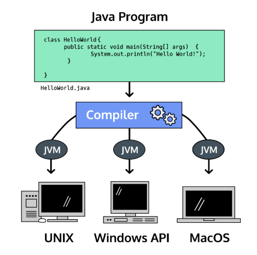

## Introduction to Java

¡Bienvenido al mundo de la programación Java!

Los lenguajes de programación permiten a los humanos escribir instrucciones que una computadora puede ejecutar. Con instrucciones precisas, las computadoras coordinan aplicaciones y sistemas que ejecutan el mundo moderno.

Sun Microsystems lanzó el lenguaje de programación Java en 1995. Java es conocido por ser simple, portátil, seguro y robusto. Aunque se lanzó hace más de veinte años, Java sigue siendo uno de los lenguajes de programación más populares en la actualidad.

Una de las razones por las que a la gente le encanta Java es la máquina virtual Java, que garantiza que el mismo código Java pueda ejecutarse en diferentes sistemas operativos y plataformas. El eslogan de Sun Microsystems’ para Java era “escribir una vez, ejecutar en todas partes”.



Los lenguajes de programación se componen de sintaxis, las instrucciones específicas que entiende Java. Escribimos sintaxis en archivos para crear programas, que son ejecutados por la computadora para realizar la tarea deseada.

Comencemos con el saludo universal para un lenguaje de programación. Exploraremos la sintaxis en el próximo ejercicio.

EJEMPLO: 
1. Estás viendo un programa de computadora escrito en Java.

    Ejecute el código en el editor de texto para ver qué se imprime en la pantalla.

    ```java
    public class HelloWorld {
        public static void main(String[] args) {
            System.out.println("Hello World!");
        }
    }
    ```