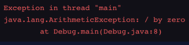
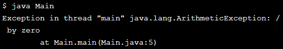

## Run-time Errors
If our program has no compile-time errors, it’ll run. This is where the fun really starts.

Errors which happen during program execution (run-time) after successful compilation are called run-time errors. Run-time errors occur when a program with no compile-time errors asks the computer to do something that the computer is unable to reliably do.

Some common run-time errors:

* Division by zero also known as division error
* Trying to open a file that doesn’t exist

There is no way for the compiler to know about these kinds of errors when the program is compiled.

Here’s an example of a run-time error message:



EXERCISE:

1. Inside ```main()``` of **Main.java**, we have ```width``` and ```length``` defined.

    Create a variable ```int ratio``` and assign it to ```length``` divided by ```width```.

    **SOLUTION:**

    **Main.java**
    ```java
    public class Main{
        public static void main(String[] args) {
            int width = 0;
            int length = 40;
            int ratio = length / width;
            System.out.println(ratio);
        }
    }
    ```

2. There’s a run-time error in Main.java.

    This program is supposed to find the ratio of a table’s dimensions.

    Compile and execute the code in the terminal.

    **SOLUTION:**    
    

3. If you attempt to run the code, you will notice the output is an error that claims we are attempting to divide by zero! Mathematically speaking, this is never allowed. Fix the problem by changing the value of ```width``` to 20.

    **SOLUTION:**

    **Main.java**
    ```java
    public class Main{
        public static void main(String[] args) {
            int width = 20;
            int length = 40;
            int ratio = length / width;
            System.out.println(ratio);
        }
    }
    ```