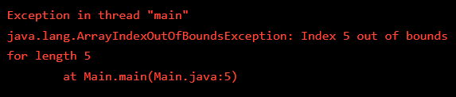

## Exceptions
In the last exercise when we were dealing with run-time errors, you might’ve noticed a new word in the error message: “Exception”.

Java uses exceptions to handle errors and other exceptional events. Exceptions are the conditions that occur at runtime and may cause the termination of the program.

When an exception occurs, Java displays a message that includes the name of the exception, the line of the program where the exception occurred, and a stack trace. The stack trace includes:

* The method that was running
* The method that invoked it
* The method that invoked that one
* and so on…

Make sure to examine it.

Some common exceptions that you will see in the wild:

* ```ArithmeticException```: Something went wrong during an arithmetic operation; for example, division by zero.
* ```NullPointerException```: You tried to access an instance variable or invoke a method on an object that is currently ```null```.
* ```ArrayIndexOutOfBoundsException```: The index you are using is either negative or greater than the last index of the array (i.e., ```array.length-1```).
* ```FileNotFoundException```: Java didn’t find the file it was looking for.

EXERCISE:

1. In the code editor, we are trying to access the element at the 5th index (the last element in ```numbers```).

    Run the code and you will see that we are getting an ```ArrayIndexOutOfBoundsException``` error.

    **SOLUTION:**

    

2. The error claims we are trying to access the 5th element which is beyond the array’s bounds.

    Modify the code to set ```lastNumber``` to access the last element of ```number```.

    **SOLUTION:**

    ```java
    public class Main {
        public static void main(String[] args) {
            int[] numbers = {1, 2, 3, 4, 5};
                
            int lastNumber = numbers[4];
                
            System.out.println("The value of the last element is: " + lastNumber);
        }
    }
    ```

    OUTPUT:
    ```git
    The value of the last element is: 5
    ```