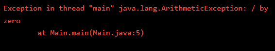
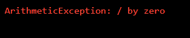

## Exception Handling
Exception handling is an essential feature of Java programming that allows us to use run-time error exceptions to make our debugging process a little easier.

One way to handle exceptions is using the ```try/catch```:

* The ```try``` statement allows you to define a block of code to be tested for ```errors``` while it is being executed.
* The ```catch``` statement allows you to define a block of code to be executed if an error occurs in the try block.

The ```try``` and ```catch``` keywords come in pairs, though you can also catch several types of exceptions in a single block:

```java
try {

    //  Block of code to try

} catch (NullPointerException e) {

    // Print the error message like this:
    System.err.println("NullPointerException: " + e.getMessage());
    
    // Or handle the error another way here

}
```

Notice how we used ```System.err.println()``` here instead of ```System.out.println()```. ```System.err.println()``` will print to the standard error and the text will be in red.

You can also chain exceptions together:

```java
try {

    //  Block of code to try

} catch (NullPointerException e) {

    //  Code to handle a NullPointerException

} catch (ArithmeticException e) {

    //  Code to handle an ArithmeticException

}
```

You can learn more about exceptions and handling them here.

EXERCISE:

1. The current **Main.java** causes an ```ArithmeticException```.

    Run the code to see the error.

    **SOLUTION:**

    

2. Inside ```main()```, surround the code that is causing the ```ArithmeticException``` with a ```try``` block.

    **SOLUTION:**

    ```java
    public class Main{
        public static void main(String[] args) {
            
            int width = 0;
            int length = 40;

            try {

                int ratio = length / width;

            } catch (ArithmeticException e) {}

        }
    }
    ```

3. Complete the ```try/catch``` block by adding a ```catch``` block that catches the ```ArithmeticException```. Inside the ```catch```-block, print out an error statement that looks like this:

    ```git
    "ArithmeticException: " + e.getMessage()
    ```

    **SOLUTION:**

    ```java
    public class Main{
        public static void main(String[] args) {
            
            int width = 0;
            int length = 40;

            try {

                int ratio = length / width;

            } catch (ArithmeticException e) {

                System.err.println("ArithmeticException: " + e.getMessage());

            }

        }
    }
    ```

    OUTPUT:
    