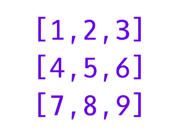
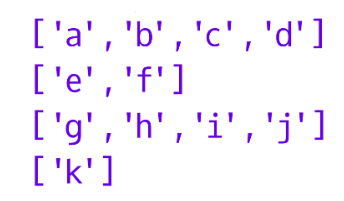
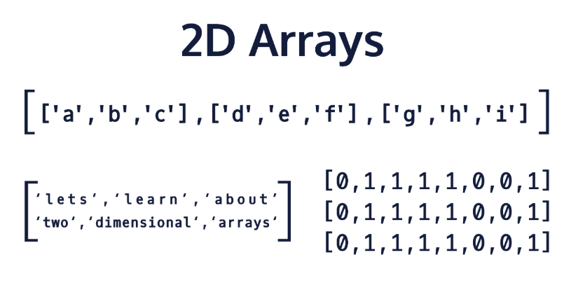

## Introduction to 2D Arrays

As we have learned previously, an array is a group of data consisting of the same type. This means that we can have an array of primitive data types (such as integers):

```java
[1, 2, 3, 4, 5]
```

We can even have an array of Objects. For example, the following example shows an array of String Objects:
```java
["hello", "world", "how", "are", "you"]
```

In Java, arrays are considered Objects; therefore, we can also have an array of arrays:
```java
[[1, 2, 3], [4, 5, 6], [7, 8, 9]]
```

These are called 2D arrays since we can logically view them as a two-dimensional matrix of values containing both rows and columns.



Additionally, we can have 2D arrays which are not rectangular in shape. These are called jagged arrays:
```java
[['a', 'b', 'c', 'd'], ['e', 'f'], ['g', 'h', 'i', 'j'], ['k']]
```



We won’t be covering jagged arrays in this lesson, but be aware that 2D arrays don’t always have to have the same number of subarrays in each array. This would cause the shape of the 2D array to not be rectangular.

Why use 2D arrays?

* It is useful to use 2D arrays for situations where you need to store and organize data by rows and columns. For example, exporting data to be used in a spreadsheet.
* You can condense multiple arrays down to a single variable using 2D arrays. For example, if you have 10 students who each have 10 different quiz grades, you can represent the overall class quiz grades as a 10x10 2D array by having each row represent a student and each column represent one of the quizzes they have taken.
* 2D arrays can be used to map out data. For example, if you want to create a game of tic-tac-toe, you can represent the game state by using a 3x3 2D array.

There are many other ways to use 2D arrays depending on the application. The only downside is that once initialized, no new rows or columns can be added or removed without copying the data to a newly initialized 2D array. This is because the length of arrays in Java are immutable (unable to be changed after creation).

 
