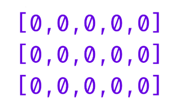
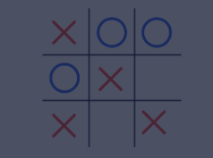

## Declaration, Initialization, and Assignment

When declaring 2D arrays, the format is similar to normal, one-dimensional arrays, except that you include an extra set of brackets after the data type. In this example, ```int``` represents the data type, the first set of brackets ```[]``` represent an array, and the second set of brackets ```[]``` represent that we are declaring an array of arrays.

```java
int[][] intTwoDArray;
```

You can think of this as creating an array (```[]```) of int arrays (```int[]```). So we end up with ```int[][]```.

Now that we’ve declared a 2D array, let’s look at how to initialize it with starting values. When initializing arrays, we define their size. Initializing a 2D array is different because, instead of only including the number of elements in the array, you also indicate how many elements are going to be in the sub-arrays. This can also be thought of as the number of rows and columns in the 2D matrix.

```java
int[][] intArray1;
intArray1 = new int[row][column];
```

Here is an example of initializing an empty 2D array with 3 rows and 5 columns.

```java
int[][] intArray2;
intArray2 = new int[3][5];
```

This results in a matrix which looks like this:


If you already know what values are going to be in the 2D array, you can initialize it and write all of the values into it at once. We can accomplish this through initializer lists

* In Java, initializer lists are a way of initializing arrays and assigning values to them at the same time
* We can use this for 2D arrays as well by creating an initializer list of initializer lists

An example of an initializer list for a regular array would be:
```java
char[] charArray = {'a', 'b', 'c', 'd'};
```

Similar to how a regular initializer list defines the size and values of the array, nested initializer lists will define the number of rows, columns, and the values for a 2D array.

There are three situations in which we can use initializer lists for 2D arrays:

1. In the case where the variable has not yet been declared, we can provide an abbreviated form since Java will infer the data type of the values in the initializer lists:

    ```java
    double[][] doubleValues = {{1.5, 2.6, 3.7}, {7.5, 6.4,5.3}, {9.8,  8.7, 7.6}, {3.6, 5.7, 7.8}};
    ```

2. If the variable has already been declared, you can initialize it by creating a ```new``` 2D array object with the initializer list values:

    ```java
    String[][] stringValues;
    stringValues = new String[][] {{"working", "with"}, {"2D", "arrays"}, {"is", "fun"}};
    ```

3. The previous method also applies to assigning a new 2D array to an existing 2D array stored in a variable.

**Main.java**
```java
public class Main {
	public static void main(String[] args) {
		// Declare a 2d array of float values called floatTwoD       
    }
}
```

**EXERCISE:**
1. Inside ```main()``` of **Main.java**, declare a 2D Array called ```floatTwoD``` that consists of ```float values```.

    **SOLUTION:**

    **Main.java**
    ```java
    public class Main {
        public static void main(String[] args) {
            // Declare a 2d array of float values called floatTwoD
            float[][] floatTwoD;       
        }
    }
    ```

2. Initialize the 2D array ```floatTwoD``` to an empty 2D array with 4 rows and 10 columns.

    Do this on a new line under the declaration.

    **SOLUTION:**

    **Main.java**
    ```java
    public class Main {
        public static void main(String[] args) {
            // Declare a 2d array of float values called floatTwoD
            float[][] floatTwoD;  
            floatTwoD = new float[4][10];    
        }
    }
    ```

3. Declare a 2D array of ```char``` values called ```ticTacToe``` that represents this tic-tac-toe board:

    

    Use the characters ```'X'```, ```'O'```, and ' ' to initialize the 2D array.

    **SOLUTION:**

    **Main.java**
    ```java
    public class Main {
        public static void main(String[] args) {
            // Declare a 2d array of float values called floatTwoD
            float[][] floatTwoD;  
            floatTwoD = new float[4][10];

            char[][] ticTacToe = {{'X', 'O', 'O'}, {'O', 'X', ' '}, {'X', ' ', 'X'}};     
        }
    }
    ```

4. We shouldn’t cheat, but let’s modify the code so ```O``` wins.

    On a new line, use initialized lists and replace all ```O```’s with ```X```’s and all ```X```’s with ```O```’s.

    *Note: Do not declare ticTacToe again.* 

    **SOLUTION:**

    **Main.java**
    ```java
    public class Main {
        public static void main(String[] args) {
            // Declare a 2d array of float values called floatTwoD
            float[][] floatTwoD;  
            floatTwoD = new float[4][10];

            char[][] ticTacToe = {{'X', 'O', 'O'}, {'O', 'X', ' '}, {'X', ' ', 'X'}}; 

            ticTacToe = new char[][] {{'O', 'X', 'X'}, {'X', 'O', ' '}, {'O', ' ', 'O'}};    
        }
    }
    ```