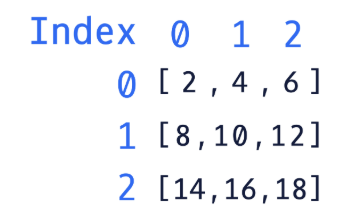
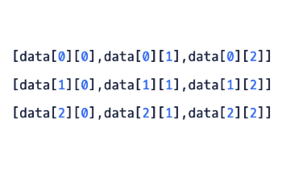

## Accessing Elements in a 2D Array

Let’s first review how to access elements in regular arrays.

For a normal array, all we need to provide is an index (starting at ```0```) which represents the position of the element we want to access. Let’s look at an example!

Given an array of five Strings:
```java
String[] words = {"cat", "dog", "apple", "bear", "eagle"};
```

We can access the first element using index ```0```, the last element using the length of the array minus one (in this case, ```4```), and any of the elements in between. We provide the index of the element we want to access inside a set of brackets. Let’s see those examples in code:
```java
// Store the first element from the String array
String firstWord = words[0]; 

// Store the last element of the String array
String lastWord = words[words.length-1];

// Store an element from a different position in the array
String middleWord = words[2];
```

Now for 2D arrays, the syntax is slightly different. This is because instead of only providing a single index, we provide two indices. Take a look at this example:

```java
// Given a 2D array of integer data
int[][] data = {{2,4,6}, {8,10,12}, {14,16,18}};

// Access and store a desired element 
int stored = data[0][2];
```

There are two ways of thinking when accessing a specific element in a 2D array.

* The first way of thinking is that the first value represents a row and the second value represents a column in the matrix
* The second way of thinking is that the first value represents which subarray to access from the main array and the second value represents which element of the subarray is accessed

The above example of the 2D array called ```data``` can be visualized like so. The indices are labeled outside of the matrix:



Using this knowledge, we now know that the result of ```int stored = data[0][2];``` would store the integer ```6```. This is because the value ```6``` is located on the first row (index ```0```) and the third column (index ```2```). Here is a template which can be used for accessing elements in 2D arrays:

```java
datatype variableName = existing2DArray[row][column];
```

Here is another way to visualize the indexing system for our example integer array seen above. We can see what row and column values are used to access the element at each position.



When accessing these elements, if either the row or column value is out of bounds, then an ```ArrayIndexOutOfBoundsException``` will be thrown by the application.

**Main.java**
```java
public class Main {
	public static void main(String[] args) {
		// Using the provided 2D array
	    int[][] intMatrix = {
            {1, 1, 1, 1, 1},
            {2, 4, 6, 8, 0},
            {9, 8, 7, 6, 5}
		};
    }
}
```

**EXERCISE:**
1. Create a variable called ```int retrievedInt``` and assign it to the value at the first row and fourth column of the 2D array ```intMatrix```.

    Print ```retrievedInt``` after creating it.

    **SOLUTION:**

    **Main.java**
    ```java
    public class Main {
        public static void main(String[] args) {
            // Using the provided 2D array
            int[][] intMatrix = {
                {1, 1, 1, 1, 1},
                {2, 4, 6, 8, 0},
                {9, 8, 7, 6, 5}
            };
            int retrievedInt = intMatrix[0][3];
        }
    }
    ```


2. Multiply the center value of ```intMatrix``` by 3 and print it.

    Make sure to access the correct element!

    **SOLUTION:**

    **Main.java**
    ```java
    public class Main {
        public static void main(String[] args) {
            // Using the provided 2D array
            int[][] intMatrix = {
                {1, 1, 1, 1, 1},
                {2, 4, 6, 8, 0},
                {9, 8, 7, 6, 5}
            };
            int retrievedInt = intMatrix[0][3];
            System.out.println(intMatrix[1][2] * 3);
        }
    }
    ```