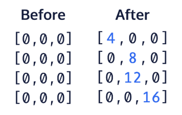

## Modifying Elements in a 2D Array

Now let’s review how to modify elements in a normal array.

For a one dimensional array, you provide the index of the element which you want to modify within a set of brackets next to the variable name and set it equal to an acceptable value:
```java
storedArray[5] = 10;
```

For 2D arrays, the format is similar, but we will provide the outer array index in the first set of brackets and the subarray index in the second set of brackets. We can also think of it as providing the row in the first set of brackets and the column index in the second set of brackets if we were to visualize the 2D array as a rectangular matrix:

```java
twoDArray[1][3] = 150;
```

To assign a new value to a certain element, make sure that the new value you are using is either of the same type or is castable to the type already in the 2D array.

Let’s say we wanted to replace four values from a new 2D array called ```intTwoD```. Look at this example code to see how to pick individual elements and assign new values to them.

```java
int[][] intTwoD = new int[4][3];

intTwoD[3][2] = 16;
intTwoD[0][0] = 4;
intTwoD[2][1] = 12;
intTwoD[1][1] = 8;
```

Here is a before and after image showing when the 2D array was first initialized compared to when the four elements were accessed and modified.



**Main.java**

```java
import java.util.Arrays;
public class Main {
	public static void main(String[] args) {
		// Using the provided 2D array
	  int[][] intMatrix = {
				{1, 1, 1, 1, 1},
				{2, 4, 6, 8, 0},
				{9, 8, 7, 6, 5}
		};   
    
		// Declare and initialize a 2D array called subMatrix
		
    
        //System.out.println(Arrays.deepToString(subMatrix));
    }
}
```

EXERCISE:
1. Create and initialize a new empty ```int``` 2D array called ```subMatrix``` with 2 rows and 2 columns.

    **SOLUTION:**

    

2. Multiply the first 2 elements of the first row of ```intMatrix``` by 5 and store them in the first row of the ```subMatrix``` array.

    Use separate lines to multiply each element of ```intMatrix```.

    *Note: Remember that arrays in Java are 0-indexed!*

3. Multiply the first 2 elements of the second row of ```intMatrix``` by 5 and store them in the second row of the ```subMatrix``` array.

    Uncomment the provided print statement to see the result.