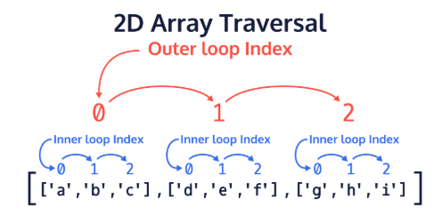

## Traversing 2D Arrays: Introduction

In the last exercise, we reviewed how to use nested loops as well as how to iterate through regular arrays using loops. In this exercise, we will apply that knowledge in order to learn how to traverse 2D arrays.

Traversing 2D arrays using loops is important because it allows us to access many elements quickly, access elements in very large 2D arrays, and even access elements in 2D arrays of unknown sizes.

Let’s remember the structure of 2D arrays in Java:

```java
char[][] letterBlock = {{'a','b','c'},{'d','e','f'},{'g','h','i'},{'j', 'k', 'l'}};
```

In Java, 2D arrays are like normal arrays, but each element is another array. This is shown by the initialized 2D array above. The outer array consists of four elements, where each element consists of a three element subarray.

Let’s see what happens when we access elements of the outer array

```java
System.out.println(Arrays.toString(letterBlock[0]) + "\n");
System.out.println(Arrays.toString(letterBlock[1]) + "\n");
System.out.println(Arrays.toString(letterBlock[2]) + "\n");
System.out.println(Arrays.toString(letterBlock[3]) + "\n");
```

Here is the output of the above code:
```git
[a, b, c]

[d, e, f]

[g, h, i]

[j, k, l]
```

As you can see, we can retrieve the entire subarray from each of the outer array elements. If you look at how we are accessing these subarrays, we are just increasing the index. This means we can access each sub-array in the 2D array using a loop!

Let’s take a look at an example which produces the same output, but can handle any sized 2D array.
```java
for(int index = 0; index < letterBlock.length; index++){
    System.out.println(Arrays.toString(letterBlock[index]) + "\n");
}
```

Here is the result:
```git
[a, b, c]

[d, e, f]

[g, h, i]

[j, k, l]
```

Now let’s remember how to access a value from the subarray. Previously, we learned that we can use the double brackets ```[][]```, where the first set of brackets contains the index of the element of the outer array and the second set of brackets contains the index of the element in the subarray. If we wanted to retrieve the letter ```'f'``` we would use:
```java
char storedLetter = letterBlock[1][2];
```

Since we know we can use a loop to retrieve each of the subarrays stored in the outer array, we can then use a nested loop to access each of the elements from the sub-array.

You might be wondering how we can figure out the number of iterations needed in order to fully traverse the 2D array.

* In order to find the number of elements in the outer array, we just need to get the length of the 2D array.

    * int lengthOfOuterArray = letterBlock.length;
    * When thinking about the 2D array in matrix form, this is the height of the matrix (the number of rows)

* In order to find the number of elements in the subarray, we can get the length of the subarray after it has been retrieved from the outer array.

    * Remember that we retrieved the sub array earlier using this format:

        * char[] subArray = letterBlock[0];

    * Therefore, we can use this to get the length of the first subarray in the 2D array

        * int lengthOfSubArray = letterBlock[0].length;
        * When thinking about the 2D array in matrix form, this is the width of the matrix (the number of columns)
    
    * In most cases, getting the length of the first subarray in the 2D array will apply to the rest of the subarrays (if it is rectangular in shape), but there are rare occasions where the length of the subarrays could be different. This occurs if the 2D array is a jagged array. We won’t be working with any jagged 2D arrays in this lesson, but it’s something to keep in mind.

Let’s look at an example!

```java
for(int a = 0; a < letterBlock.length; a++) {
    for(int b = 0; b < letterBlock[a].length; b++) {
        System.out.print("Accessed: " + letterBlock[a][b] + "\t");
    }
    System.out.println();
}
```

You can think of the variable ```a``` as being the outer loop index, and the variable ```b``` as being the inner loop index.

Here is the output:
```git
Accessed: a Accessed: b Accessed: c 
Accessed: d Accessed: e Accessed: f 
Accessed: g Accessed: h Accessed: i 
```

Within the nested for loop, we can see that each of the subarray elements are being accessed by using the outer loop index for the outer array, and the inner loop index for the subarray.

Here is a diagram to help visualize how the 2D array is traversed using nested loops:



**Main.java**

```java
public class Main {
	public static void main(String[] args) {
		//Given the provided 2d array
		int[][] intMatrix = {
            { 4,  6,  8, 10, 12, 14, 16},
            {18, 20, 22, 24, 26, 28, 30},
            {32, 34, 36, 38, 40, 42, 44},
            {46, 48, 50, 52, 54, 56, 58},
            {60, 62, 64, 66, 68, 70, 79}
		};
		
		int sum = 0;
		for(int i=0; i<-1; i++) {
			for(int j = 0; j < -1; j++) {
				// Add a line to calculate sum of all elements
			}
		}
		System.out.println(sum);
	}
}
```

EXERCISE:
1. Create an ```int``` variable called ```rows``` and store the length of the 2D array ```intMatrix``` in it. This dimension is the number of rows the array contains.

    **SOLUTION:**

    ```java
    public class Main {
        public static void main(String[] args) {
            //Given the provided 2d array
            int[][] intMatrix = {
                { 4,  6,  8, 10, 12, 14, 16},
                {18, 20, 22, 24, 26, 28, 30},
                {32, 34, 36, 38, 40, 42, 44},
                {46, 48, 50, 52, 54, 56, 58},
                {60, 62, 64, 66, 68, 70, 79}
            };
            
            int rows = intMatrix.length;
            
            int sum = 0;
            for(int i=0; i<-1; i++) {
                for(int j = 0; j < -1; j++) {
                    // Add a line to calculate sum of all elements
                    
                }
            }
            System.out.println(sum);
        }
    }
    ```

2. Create another ```int``` variable called ```columns``` and store the length of the first row ```intMatrix``` in it. This dimension is the number of columns in the array.

    **SOLUTION:**

    ```java
    public class Main {
        public static void main(String[] args) {
            //Given the provided 2d array
            int[][] intMatrix = {
                { 4,  6,  8, 10, 12, 14, 16},
                {18, 20, 22, 24, 26, 28, 30},
                {32, 34, 36, 38, 40, 42, 44},
                {46, 48, 50, 52, 54, 56, 58},
                {60, 62, 64, 66, 68, 70, 79}
            };
            
            int rows = intMatrix.length;
            int columns = intMatrix[0].length;
            
            int sum = 0;
            for(int i=0; i<-1; i++) {
                for(int j = 0; j < -1; j++) {
                    // Add a line to calculate sum of all elements
                    
                }
            }
            System.out.println(sum);
        }
    }
    ```

3. Replace the outer and inner for loop conditions to iterate through the 2D array ```intMatrix```.

    Inside the inner ```for``` loop, add a line to calculate the sum of all elements of the 2D array ```intMatrix```.

    **SOLUTION:**

    ```java
    public class Main {
        public static void main(String[] args) {
            //Given the provided 2d array
            int[][] intMatrix = {
                { 4,  6,  8, 10, 12, 14, 16},
                {18, 20, 22, 24, 26, 28, 30},
                {32, 34, 36, 38, 40, 42, 44},
                {46, 48, 50, 52, 54, 56, 58},
                {60, 62, 64, 66, 68, 70, 79}
            };
            
            int rows = intMatrix.length;
            int columns = intMatrix[0].length;
            
            int sum = 0;
            for(int i=0; i< rows; i++) {
			    for(int j = 0; j < columns; j++) {
                    // Add a line to calculate sum of all elements
                    sum += intMatrix[i][j];
                }
            }
            System.out.println(sum);
        }
    }
    ```
    

