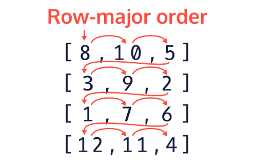
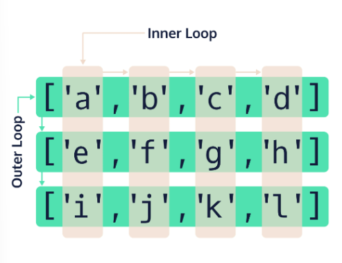

## Traversing 2D Arrays: Row-Major Order

Row-major order for 2D arrays refers to a traversal path which moves horizontally through each row starting at the first row and ending with the last.

Although we have already looked at how 2D array objects are stored in Java, this ordering system conceptualizes the 2D array into a rectangular matrix and starts the traversal at the top left element and ends at the bottom right element.

Here is a diagram which shows the path through the 2D array:



This path is created by the way we set up our nested loops. In the previous exercise, we looked at how we can traverse the 2D array by having nested loops in a variety of formats, but if we want to control the indices, we typically use standard for loops.

Let’s take a closer look at the structure of the nested for loops when traversing a 2D array:

Given this 2D array of strings describing the element positions:

```java
String[][] matrix = {{"[0][0]", "[0][1]", "[0][2]"}, 
                     {"[1][0]", "[1][1]", "[1][2]"},
                     {"[2][0]", "[2][1]", "[2][2]"},
                     {"[3][0]", "[3][1]", "[3][2]"}};
```

Lets keep track of the total number of iterations as we traverse the 2D array:
```java
int stepCount = 0;
        
for(int a = 0; a < matrix.length; a++) {
    for(int b = 0; b < matrix[a].length; b++) {
        System.out.print("Step: " + stepCount);
        System.out.print(", Element: " + matrix[a][b]);
        System.out.println();
        stepCount++;
    }
}
```

Here is the output of the above code:
```git
Step: 0, Element: [0][0]
Step: 1, Element: [0][1]
Step: 2, Element: [0][2]
Step: 3, Element: [1][0]
Step: 4, Element: [1][1]
Step: 5, Element: [1][2]
Step: 6, Element: [2][0]
Step: 7, Element: [2][1]
Step: 8, Element: [2][2]
Step: 9, Element: [3][0]
Step: 10, Element: [3][1]
Step: 11, Element: [3][2]
```

The step value increases with every iteration within the inner for loop. Because of this, we can see the order in which each element is accessed. If we follow the step value in the output shows us that the elements are accessed in the same order as the row-major diagram above. Now why is that?

This is because in our for loop, we are using the number of rows as the termination condition within the outer for loop header ```a < matrix.length;``` Additionally, we are using the number of columns ```b < matrix[a].length``` as the termination condition for our inner loop. Logically we are saying: “For every row in our matrix, iterate through every single column before moving to the next row”. This is why our above example is traversing the 2D array using row-major order.

Here is a diagram showing which loop accesses which part of the 2D array for row-major order:



**Why Use Row-Major Order?**

Row-major order is important when we need to process data in our 2D array by row. You can be provided data in a variety of formats and you may need to perform calculations of rows of data at a time instead of individual elements. Let’s take one of our previous checkpoint exercises as an example. You were asked to calculate the sum of the entire 2D array of integers by traversing and accessing each element. Now, if we wanted to calculate the sum of each row, or take the average of each row, we can use row-major order to access the data in the order that we need. Let’s look at an example!

Given a 6X3 2D array of doubles:
```java
double[][] data = {{0.51,0.99,0.12},
                   {0.28,0.99,0.89},
                   {0.05,0.94,0.05},
                   {0.32,0.22,0.61},
                   {1.00,0.95,0.09},
                   {0.67,0.22,0.17}};
```

Calculate the sum of each row using row-major order:
```java
double rowSum = 0.0;
for(int o = 0; o < data.length; o++) {
    rowSum = 0.0;
    for(int i = 0; i < data[o].length; i++) {
        rowSum += data[o][i];
    }
    System.out.println("Row: " + o +", Sum: " + rowSum);
}
```

The output of the above code is:
```git
Row: 0, Sum: 1.62
Row: 1, Sum: 2.16
Row: 2, Sum: 1.04
Row: 3, Sum: 1.15
Row: 4, Sum: 2.04
Row: 5, Sum: 1.06
```

An interesting thing to note is that, due to the way 2D arrays are structured in Java, enhanced for loops are always in row-major order. This is because an enhanced for loop iterates through the elements of the outer array which causes the terminating condition to be the length of the 2D array which is the number of rows.

**Main.java**

```java
public class Main {
	public static void main(String[] args) {
		// Given runner lap data
		double[][] times = {{64.791, 75.972, 68.950, 79.039, 73.006, 74.157}, {67.768, 69.334, 70.450, 67.667, 75.686, 76.298}, {72.653, 77.649, 74.245, 62.121, 63.379, 79.354}};
		
		double runnerTime = 0.0;
		for(int outer = -1; outer < -1; outer++) {
			runnerTime = 0.0;
			for(int inner = -1; inner < -1; inner++) {
        		System.out.println("Runner index: " + outer + ", Time index: " + inner);
				// Add a line to sum up the values in each row.
        
			}
            double averageVal = 0;

			System.out.println("Sum of runner " + outer + " times: " + runnerTime);
			System.out.println("Average of runner " + outer + ": " + averageVal);
		}
	}
}
```

EXERCISE:
1. We’ve provided a 2D array that contains runner lap data.

    Look at the ```for``` loops that are used to iterate through this 2D array.

    Something seems wrong: the headers!!

    Correct the ```for``` loop headers to perform row-major traversal.

    Use the iterators ```outer``` and ```inner``` for the outer and inner loops.

    **SOLUTION:**

    ```java
    public class Main {
        public static void main(String[] args) {
            
            // Given runner lap data
            double[][] times = {{64.791, 75.972, 68.950, 79.039, 73.006, 74.157}, {67.768, 69.334, 70.450, 67.667, 75.686, 76.298}, {72.653, 77.649, 74.245, 62.121, 63.379, 79.354}};
            
            double runnerTime = 0.0;

            for(int outer = 0; outer < times.length; outer++) {
                runnerTime = 0.0;
                for(int inner = 0; inner < times[outer].length; inner++) {
                    System.out.println("Runner index: " + outer + ", Time index: " + inner);
                    // Add a line to sum up the values in each row.
                }
                double averageVal = 0;

                System.out.println("Sum of runner " + outer + " times: " + runnerTime);
                System.out.println("Average of runner " + outer + ": " + averageVal);
            }

        }
    }
    ```

2. A variable called ```runnerTime``` is defined in the code.

    Add a line in the body of the inner ```for``` loop to sum up the values for each row in the runner data and store the result in the variable ```runnerTime```.

3. Below the nested ```for``` loops, we have a variable called ```averageVal```.

    Write a line to find the average time of each runner and store it in ```averageVal```.