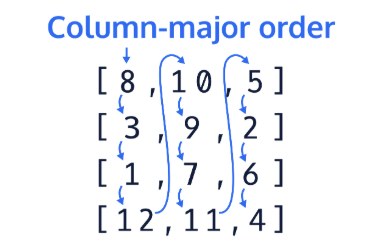
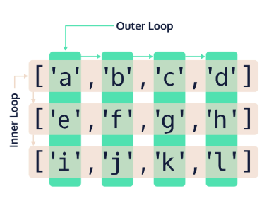

## Traversing 2D Arrays: Column-Major Order

Column-major order for 2D ```arrays``` refers to a traversal path which moves vertically down each column starting at the first column and ending with the last.

This ordering system also conceptualizes the 2D array into a rectangular matrix and starts the traversal at the top left element and ends at the bottom right element. Column-major order has the same starting and finishing point as row-major order, but it’s traversal is completely different

Here is a diagram which shows the path through the 2D array:



In order to perform column-major traversal, we need to set up our nested ```loops``` in a different way. We need to change the outer loop from depending on the number of rows, to depending on the number of columns. Likewise we need the inner loop to depend on the number of rows in its termination condition.

Let’s look at our example 2D array from the last exercise and see what needs to be changed.

Given this 2D array of ```strings``` describing the element positions:

```java
String[][] matrix = {
    {"[0][0]", "[0][1]", "[0][2]"}, 
    {"[1][0]", "[1][1]", "[1][2]"},
    {"[2][0]", "[2][1]", "[2][2]"},
    {"[3][0]", "[3][1]", "[3][2]"}
};
```

Let’s keep track of the total number of iterations as we traverse the 2D array. We also need to change the termination condition (middle section) within the outer and inner for loop.

```java
int stepCount = 0;
                
for(int a = 0; a < matrix[0].length; a++) {
    for(int b = 0; b < matrix.length; b++) {
        System.out.print("Step: " + stepCount);
        System.out.print(", Element: " + matrix[b][a]);
        System.out.println();
        stepCount++;
    }
}   
```

Here is the ```output``` of the above code:
```git
Step: 0, Element: [0][0]
Step: 1, Element: [1][0]
Step: 2, Element: [2][0]
Step: 3, Element: [3][0]
Step: 4, Element: [0][1]
Step: 5, Element: [1][1]
Step: 6, Element: [2][1]
Step: 7, Element: [3][1]
Step: 8, Element: [0][2]
Step: 9, Element: [1][2]
Step: 10, Element: [2][2]
Step: 11, Element: [3][2]
```

As you can see in the code above, the way we accessed the elements from our 2D array of strings called ```matrix``` is different from the way we accessed them when using row-major order. Let’s remember that the way we get the number of columns is by using ```matrix[0].length``` and the way we get the number of rows is by using ```matrix.length```. Because of these changes to our for loops, our ```iterator``` ```a``` now iterates through every column while our iterator ```b``` iterates through every row. Since our iterators now represent the opposite values, whenever we access an element from our 2D array, we need to keep in mind what indices we are passing to our accessor. Remember the format we use for accessing the elements ```matrix[row][column]```? Since ```a``` now iterates through our column indices, we place it in the right set of brackets, and the ```b``` is now placed in the left set of brackets.

Here is a diagram showing which loop accesses which part of the 2D array for column-major order:



**Why Use Column-Major Order?**

Column major order is important because there are a lot of cases when you need to process data vertically. Let’s say that we have a chart of information which includes temperature data about each day. The top of each column is labeled with a day, and each row represents an hour. In order to find the average temperature per day, we would need to traverse the data vertically since each column represents a day. As mentioned in the last exercise, data can be provided in many different formats and shapes and you will need to know how to traverse it accordingly.

Let’s look at our sum example from the last exercise, but now using column-major order.

Given a 6X3 2D array of doubles:

```java
double[][] data = {{0.51,0.99,0.12},
                   {0.28,0.99,0.89},
                   {0.05,0.94,0.05},
                   {0.32,0.22,0.61},
                   {1.00,0.95,0.09},
                   {0.67,0.22,0.17}};
```

Calculate the sum of each column using column-major order:
```java
double colSum = 0.0;
for(int o = 0; o < data[0].length; o++) {
    colSum = 0.0;
    for(int i = 0; i < data.length; i++) {
        colSum += data[i][o];
    }
    System.out.println("Column: " + o +", Sum: " + colSum);
}
```

The output of the above code is:
```git
Column: 0, Sum: 2.83
Column: 1, Sum: 4.31
Column: 2, Sum: 1.93
```

Let’s try an example!

We will be using the same runner data from the last exercise, but this time we are going to take the average times per lap rather than per runner. This requires that we use column-major traversal.

**Main.java**
```java
public class Main {
	public static void main(String[] args) {
    // Given runner lap data
		double[][] times = {{64.791, 75.972, 68.950, 79.039, 73.006, 74.157}, {67.768, 69.334, 70.450, 67.667, 75.686, 76.298}, {72.653, 77.649, 74.245, 62.121, 63.379, 79.354}};
		
		double lapTime = 0.0;
		for(int outer = -1; outer < -1; outer++){
			lapTime = 0.0;
			for(int inner = -1; inner < -1; inner++){
				System.out.println("Lap index: " + outer + ", Time index: " + inner);
				// Add a line to sum up the values
        
			}
			double averageVal = 0;

			System.out.println("Sum of lap " + outer + " times: " + lapTime);
			System.out.println("Average time for lap " + outer + ": " + averageVal);
		}
	}
}
```

EXERCISE:
1. Previously, we used row-major to iterate through the 2D array.

    We have the same 2D array.

    Update the nested ```for``` loops to perform the column-major traversal.

    **SOLUTION:**

    ```java
    public class Main {
        public static void main(String[] args) {
            // Given runner lap data
            double[][] times = {{64.791, 75.972, 68.950, 79.039, 73.006, 74.157}, {67.768, 69.334, 70.450, 67.667, 75.686, 76.298}, {72.653, 77.649, 74.245, 62.121, 63.379, 79.354}};
            
            double lapTime = 0.0;
            for(int outer = 0; outer < times[0].length; outer++){
                lapTime = 0.0;
                for(int inner = 0; inner < times.length; inner++){
                    System.out.println("Lap index: " + outer + ", Time index: " + inner);
                    // Add a line to sum up the values
            
                }
                double averageVal = 0;

                System.out.println("Sum of lap " + outer + " times: " + lapTime);
                System.out.println("Average time for lap " + outer + ": " + averageVal);
            }
        }
    }
    ```

    OUTPUT:
    ```git
    Lap index: 0, Time index: 0
    Lap index: 0, Time index: 1
    Lap index: 0, Time index: 2
    Sum of lap 0 times: 0.0
    Average time for lap 0: 0.0
    Lap index: 1, Time index: 0
    Lap index: 1, Time index: 1
    Lap index: 1, Time index: 2
    Sum of lap 1 times: 0.0
    Average time for lap 1: 0.0
    Lap index: 2, Time index: 0
    Lap index: 2, Time index: 1
    Lap index: 2, Time index: 2
    Sum of lap 2 times: 0.0
    Average time for lap 2: 0.0
    Lap index: 3, Time index: 0
    Lap index: 3, Time index: 1
    Lap index: 3, Time index: 2
    Sum of lap 3 times: 0.0
    Average time for lap 3: 0.0
    Lap index: 4, Time index: 0
    Lap index: 4, Time index: 1
    Lap index: 4, Time index: 2
    Sum of lap 4 times: 0.0
    Average time for lap 4: 0.0
    Lap index: 5, Time index: 0
    Lap index: 5, Time index: 1
    Lap index: 5, Time index: 2
    Sum of lap 5 times: 0.0
    Average time for lap 5: 0.0
    ```

2. Inside the inner ```for``` loop, add a line to sum up the values for each column and store it in the variable ```lapTime```.

    **SOLUTION:**

    ```java
    public class Main {
        public static void main(String[] args) {
            // Given runner lap data
            double[][] times = {{64.791, 75.972, 68.950, 79.039, 73.006, 74.157}, {67.768, 69.334, 70.450, 67.667, 75.686, 76.298}, {72.653, 77.649, 74.245, 62.121, 63.379, 79.354}};
            
            double lapTime = 0.0;
            for(int outer = 0; outer < times[0].length; outer++){
                lapTime = 0.0;
                for(int inner = 0; inner < times.length; inner++){
                    System.out.println("Lap index: " + outer + ", Time index: " + inner);
                    // Add a line to sum up the values
                    lapTime += times[inner][outer];
                }
                double averageVal = 0;

                System.out.println("Sum of lap " + outer + " times: " + lapTime);
                System.out.println("Average time for lap " + outer + ": " + averageVal);
            }
        }
    }
    ```

    OUTPUT:
    ```git
    Lap index: 0, Time index: 0
    Lap index: 0, Time index: 1
    Lap index: 0, Time index: 2
    Sum of lap 0 times: 205.212
    Average time for lap 0: 0.0
    Lap index: 1, Time index: 0
    Lap index: 1, Time index: 1
    Lap index: 1, Time index: 2
    Sum of lap 1 times: 222.95499999999998
    Average time for lap 1: 0.0
    Lap index: 2, Time index: 0
    Lap index: 2, Time index: 1
    Lap index: 2, Time index: 2
    Sum of lap 2 times: 213.645
    Average time for lap 2: 0.0
    Lap index: 3, Time index: 0
    Lap index: 3, Time index: 1
    Lap index: 3, Time index: 2
    Sum of lap 3 times: 208.82700000000003
    Average time for lap 3: 0.0
    Lap index: 4, Time index: 0
    Lap index: 4, Time index: 1
    Lap index: 4, Time index: 2
    Sum of lap 4 times: 212.071
    Average time for lap 4: 0.0
    Lap index: 5, Time index: 0
    Lap index: 5, Time index: 1
    Lap index: 5, Time index: 2
    Sum of lap 5 times: 229.80899999999997
    Average time for lap 5: 0.0
    ```

3. Below the declared variable called ```averageVal```, add a line to calculate the average time of each lap.

    **SOLUTION:**

    ```java
    public class Main {
        public static void main(String[] args) {
            // Given runner lap data
            double[][] times = {{64.791, 75.972, 68.950, 79.039, 73.006, 74.157}, {67.768, 69.334, 70.450, 67.667, 75.686, 76.298}, {72.653, 77.649, 74.245, 62.121, 63.379, 79.354}};
            
            double lapTime = 0.0;
            for(int outer = 0; outer < times[0].length; outer++){
                lapTime = 0.0;
                for(int inner = 0; inner < times.length; inner++){
                    System.out.println("Lap index: " + outer + ", Time index: " + inner);
                    // Add a line to sum up the values
                    lapTime += times[inner][outer];
                }
                double averageVal = 0;
                averageVal = lapTime / times.length;
                System.out.println("Sum of lap " + outer + " times: " + lapTime);
                System.out.println("Average time for lap " + outer + ": " + averageVal);
            }
        }
    }
    ```

    OUTPUT:
    ```git
    Lap index: 0, Time index: 0
    Lap index: 0, Time index: 1
    Lap index: 0, Time index: 2
    Sum of lap 0 times: 205.212
    Average time for lap 0: 68.404
    Lap index: 1, Time index: 0
    Lap index: 1, Time index: 1
    Lap index: 1, Time index: 2
    Sum of lap 1 times: 222.95499999999998
    Average time for lap 1: 74.31833333333333
    Lap index: 2, Time index: 0
    Lap index: 2, Time index: 1
    Lap index: 2, Time index: 2
    Sum of lap 2 times: 213.645
    Average time for lap 2: 71.215
    Lap index: 3, Time index: 0
    Lap index: 3, Time index: 1
    Lap index: 3, Time index: 2
    Sum of lap 3 times: 208.82700000000003
    Average time for lap 3: 69.60900000000001
    Lap index: 4, Time index: 0
    Lap index: 4, Time index: 1
    Lap index: 4, Time index: 2
    Sum of lap 4 times: 212.071
    Average time for lap 4: 70.69033333333333
    Lap index: 5, Time index: 0
    Lap index: 5, Time index: 1
    Lap index: 5, Time index: 2
    Sum of lap 5 times: 229.80899999999997
    Average time for lap 5: 76.603
    ```