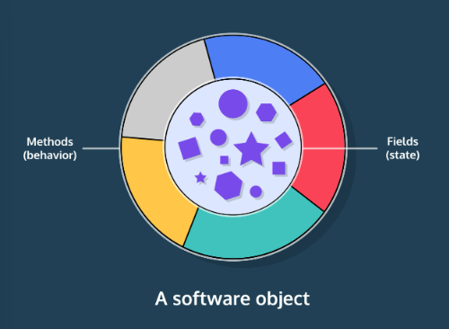
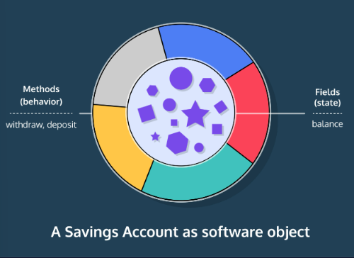

## Introduction to Classes
In every Java program, classes serve as representations of the real world.

A class is a template for creating objects in Java. Think of it as a blueprint for the representation of a real-world object. A class outlines the necessary components and how they interact with each other. For example, consider a program designed to monitor student test scores. This program can include classes such as ```Student``` and ```Grade``` to represent real-world entities of students and their grades. The ```Student``` class, representing a student, will have fields to store the student ID, all courses the student can enroll in, and several other fields that capture relevant information.



We represent each student as an instance, or object, of the ```Student``` class.

This is object-oriented programming: programs are built using objects.

Let’s consider another example: a savings account at a bank.

What are the relevant details of a savings account in a bank? How about these fields:

* Name of the owner
* Bank account number
* Amount of money in the account

What should a savings account do? Let’s go with these functions:

* Deposit money.
* Withdraw money.
* We can represent this data in a class called ```SavingsAccount```.

Imagine two people each have a bank account. Each of their accounts will be represented by an instance of the ```SavingsAccount``` class.



EXAMPLE:

**Store.java**
```java
public class Store {
  // instance fields
  String productType;
  int inventoryCount;
  double inventoryPrice;
  
  // constructor method
  public Store(String product, int count, double price) {
    productType = product;
    inventoryCount = count;
    inventoryPrice = price;
  }
  
  // main method
  public static void main(String[] args) {
    Store lemonadeStand = new Store("lemonade", 42, .99);
    Store cookieShop = new Store("cookies", 12, 3.75);
    
    System.out.println("Our first shop sells " + lemonadeStand.productType + " at " + lemonadeStand.inventoryPrice + " per unit.");
    
    System.out.println("Our second shop has " + cookieShop.inventoryCount + " units remaining.");
  }
}
```

**Main.java**
```java
public class Main{
    public static void main(String[] args) {
        Store lemonadeStand = new Store("lemonade", 42, .99);
        Store cookieShop = new Store("cookies", 12, 3.75);
        
        System.out.println("Our first shop sells " + lemonadeStand.productType + " at " + lemonadeStand.inventoryPrice + " per unit.");
        
        System.out.println("Our second shop has " + cookieShop.inventoryCount + " units remaining.");
    }
}
```

