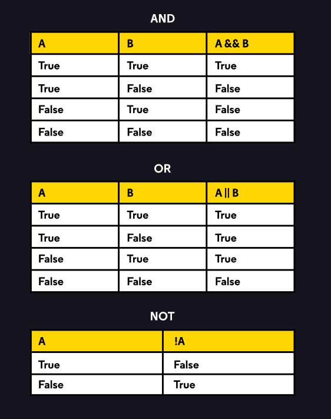

## Introduction to Conditional Operators
Java includes operators that only use boolean values. These conditional operators help simplify expressions containing complex boolean relationships by reducing multiple boolean values to a single value: ```true``` or ```false```.

For example, what if we want to run a code block only if multiple conditions are true. We could use the AND operator: ```&&```.

Or, we want to run a code block if at least one of two conditions are ```true```. We could use the OR operator: ```||```.

Finally, we can produce the opposite value, where ```true``` becomes ```false``` and ```false``` becomes ```true```, with the NOT operator: ```!```.

Understanding these complex relationships can feel overwhelming at first. Luckily, truth tables, like the ones seen to the right, can assist us in determining the relationship between two boolean-based conditions.

In this lesson, we’ll explore each of these conditional operators to see how they can be implemented into our conditional statements.

**Reservation.java**
```java
ublic class Reservation {

    int guestCount;
    int restaurantCapacity;
    boolean isRestaurantOpen;
    boolean isConfirmed;
    
    public Reservation(int count, int capacity, boolean open) {
        if (count < 1 || count > 8) {
            System.out.println("Invalid reservation!");
        }
        guestCount = count;
        restaurantCapacity = capacity;
        isRestaurantOpen = open;
    }  
    
    public void confirmReservation() {
        if (restaurantCapacity >= guestCount && isRestaurantOpen) {
            System.out.println("Reservation confirmed");
            isConfirmed = true;
        } else {
            System.out.println("Reservation denied");
            isConfirmed = false;
        }
    }
    
    public void informUser() {
        if (!isConfirmed) {
            System.out.println("Unable to confirm reservation, please contact restaurant.");
        } else {
            System.out.println("Please enjoy your meal!");
        }
    }
    
    public static void main(String[] args) {
        Reservation partyOfThree = new Reservation(3, 12, true);
        Reservation partyOfFour = new Reservation(4, 3, true);
        partyOfThree.confirmReservation();
        partyOfThree.informUser();
        partyOfFour.confirmReservation();
        partyOfFour.informUser();
    }
}
```




