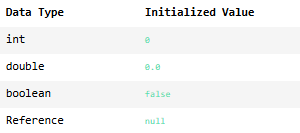

## Creating an Empty Array
We can also create empty arrays and then fill the items one by one. Empty arrays have to be initialized with a fixed size:
```java
String[] menuItems = new String[5];
```

Once you declare this size, it cannot be changed! This array will always be of size ```5```.

After declaring and initializing, we can set each index of the array to be a different item:
```java
menuItems[0] = "Veggie hot dog";
menuItems[1] = "Potato salad";
menuItems[2] = "Cornbread";
menuItems[3] = "Roasted broccoli";
menuItems[4] = "Coffee ice cream";
```

This group of commands has the same effect as assigning the entire array at once:
```java
String[] menuItems = {"Veggie hot dog", "Potato salad", "Cornbread", "Roasted broccoli", "Coffee ice cream"};
```

We can also change an item after it has been assigned! Let’s say this restaurant is changing its broccoli dish to a cauliflower one:
```java
menuItems[3] = "Baked cauliflower";
```

Now, the array looks like:
```git
["Veggie hot dog", "Potato salad", "Cornbread", "Baked cauliflower", "Coffee ice cream"]
```

### Keep Reading: AP Computer Science A Students
When we use ```new``` to create an empty array, each element of the array is initialized with a specific value depending on what type the element is:


For example, consider the following arrays:
```java
String[] my_names = new String[5];
int[] my_ages = new int[5];
```

Because a String is a reference to an Object, ```my_names``` will contain five ```null```s. ```my_ages``` will contain five 0s to begin with.

**Newsfeed.java**
```java
public class Newsfeed {
    String[] topics = {"Opinion", "Tech", "Science", "Health"};
    int[] views = {0, 0, 0, 0};
    String[] favoriteArticles;
    
    public Newsfeed(){
        // Initialize favoriteArticles here:
        
    }
    
    public void setFavoriteArticle(int favoriteIndex, String newArticle){
        // Add newArticle to favoriteArticles:
        
    }
}
```

**Main.java**
```java
import java.util.Arrays;
public class Main {
    public static void main(String[] args) {
        Newsfeed sampleFeed = new Newsfeed();
        
        sampleFeed.setFavoriteArticle(2, "Path Finding in an Unknown World");
        sampleFeed.setFavoriteArticle(3, "Organic Eye Implants");
        sampleFeed.setFavoriteArticle(0, "Oil News");
        
        System.out.println(Arrays.toString(sampleFeed.favoriteArticles));
    }
}
```

EXERCISE:
1. We’ve declared a ```String``` array called ```favoriteArticles``` as an instance field.

    We’ll keep track of the user’s top 10 favorite articles in this string array.

    In the constructor, ```Newsfeed()```, initialize ```favoriteArticles``` as a new empty String array of size 10.

    SOLUTION:

    **Newsfeed.java**

    ```java
    public class Newsfeed {
        String[] topics = {"Opinion", "Tech", "Science", "Health"};
        int[] views = {0, 0, 0, 0};
        String[] favoriteArticles;
        
        public Newsfeed(){
            // Initialize favoriteArticles here:
            favoriteArticles = new String[10];
        }
        
        public void setFavoriteArticle(int favoriteIndex, String newArticle){
            // Add newArticle to favoriteArticles:
            
        }
    }
    ```

2. We have created a ```setFavoriteArticle()``` method that accepts ```favoriteIndex``` and ```newArticle``` as parameters.

    Inside ```setFavoriteArticle()```, set the value of the ```favoriteArticles``` array at index ```favoriteIndex``` to the value of ```newArticle```.

    For example, if we called ```setFavoriteArticle(2, "Celebrity Hands Throughout the Decades")```, the value of ```favoriteArticles``` at index 2 would be set to “Celebrity Hands Throughout the Decades”.

    Switch over to **Main.java** and run the code.

    SOLUTION:

    **Newsfeed.java**

    ```java
    public class Newsfeed {
        String[] topics = {"Opinion", "Tech", "Science", "Health"};
        int[] views = {0, 0, 0, 0};
        String[] favoriteArticles;
        
        public Newsfeed(){
            // Initialize favoriteArticles here:
            favoriteArticles = new String[10];
        }
        
        public void setFavoriteArticle(int favoriteIndex, String newArticle){
            // Add newArticle to favoriteArticles:
            favoriteArticles[favoriteIndex] = newArticle;
        }
    }
    ```

    OUTPUT:
    ```git
    [Oil News, null, Path Finding in an Unknown World, Organic Eye Implants, null, null, null, null, null, null]
    ```