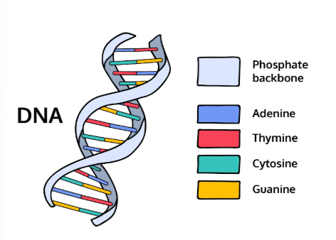

## DNA Sequencing
The genome of an organism stores all the genetic information necessary to build and maintain that organism. It is an organism’s complete set of DNA.

```DNA``` is composed of a series of nucleotides abbreviated as:

* ```A```: Adenine
* ```C```: Cytosine
* ```G```: Guanine
* ```T```: Thymine



So a strand of DNA could look something like ```ACGAATTCCG```.

Write a DNA.java program that determines whether there is a protein in a strand of DNA.

A protein has the following qualities:

1. It begins with a “start codon”: ```ATG```.
2. It ends with a “stop codon”: ```TGA```.
3. In between, each additional codon is a sequence of three nucleotides.

So for example:
* ```ATGCGATACTGA``` is a protein because it has the start codon ```ATG```, the stop codon ```TGA```, and the length is divisible by 3.
* ```ATGCGATAGA``` is not a protein because the sequence length is not divisible by 3, so the third condition is not satisfied.

=====================================================================

### String methods:
1. One
    
    **string methods	    value**
    * ```length()```	        returns the length
    * ```concat()```	        concatenates two strings
    * ```equals()```	        checks for equality between two strings
    * ```indexOf()```	        returns the index of a substring
    * ```charAt()```	        returns a character
    * ```substring()```	    returns a substring
    * ```toUpperCase()```	    returns the upper case version
    * ```toLowerCase()```	    returns the lower case version

    **Note:** Scroll through the table to see each method.

### Setting up:

2. Let’s create a skeleton for the program. Add the following into **DNA.java**:

    ```java
    public class DNA {
    
        public static void main(String[] args) {
                    
            //  -. .-.   .-. .-.   .
            //    \   \ /   \   \ / 
            //   / \   \   / \   \  
            //  ~   `-~ `-`   `-~ `-
            
        }
    
    }
    ```

3. Write a comment near the top of the program that describes what the program does.

    **SOLUTION:**

    ```java
    /*
    Author: Jose Pardo
    Project: DNA Project in java
    */
    public class DNA {
    
        public static void main(String[] args) {
                    
            //  -. .-.   .-. .-.   .
            //    \   \ /   \   \ / 
            //   / \   \   / \   \  
            //  ~   `-~ `-`   `-~ `-

        }
    
    }
    ```

4. Here are the three DNA strands that you are going to use to test your program:

    * ```"ATGCGATACGCTTGA"```
    * ```"ATGCGATACGTGA"```
    * ```"ATTAATATGTACTGA"```

    Store them in different strings: ```dna1```, ```dna2```, and ```dna3```.

    **SOLUTION:**

    ```java
    /*
    Author: Jose Pardo
    Project: DNA Project in java
    */
    public class DNA {
    
        public static void main(String[] args) {
                    
            //  -. .-.   .-. .-.   .
            //    \   \ /   \   \ / 
            //   / \   \   / \   \  
            //  ~   `-~ `-`   `-~ `-

            String dna1 = "ATGCGATACGCTTGA";
            String dna2 = "ATGCGATACGTGA";
            String dna3 = "ATTAATATGTACTGA";

        }
    
    }
    ```

### Find the length:

5. Create a generic ```String``` variable called ```dna``` that can be set to any DNA sequence (```dna1```, ```dna2```, ```dna3```).

    **SOLUTION:**

    ```java
    /*
    Author: Jose Pardo
    Project: DNA Project in java
    */
    public class DNA {
    
        public static void main(String[] args) {
                    
            //  -. .-.   .-. .-.   .
            //    \   \ /   \   \ / 
            //   / \   \   / \   \  
            //  ~   `-~ `-`   `-~ `-

            String dna1 = "ATGCGATACGCTTGA";
            String dna2 = "ATGCGATACGTGA";
            String dna3 = "ATTAATATGTACTGA";

            String dna = dna1;

        }
    
    }
    ```

6. To warm up, find the length of the ```dna``` string.

    **SOLUTION:**

    ```java
    /*
    Author: Jose Pardo
    Project: DNA Project in java
    */
    public class DNA {
    
        public static void main(String[] args) {
                    
            //  -. .-.   .-. .-.   .
            //    \   \ /   \   \ / 
            //   / \   \   / \   \  
            //  ~   `-~ `-`   `-~ `-

            String dna1 = "ATGCGATACGCTTGA";
            String dna2 = "ATGCGATACGTGA";
            String dna3 = "ATTAATATGTACTGA";

            String dna = dna1;
            int lengthDna = dna1.length();
            System.out.println(lengthDna);

        }
    
    }
    ```

### Find the start codon and stop codon:

7. Remember that a protein has the following qualities:

    1. It begins with a start codon ```ATG```.
    2. It ends with a stop codon ```TGA```.
    3. In between, the number of nucleotides is divisible by 3.
    _______________________________________________________________

    First, let’s start with the first condition. Does the DNA strand have the start codon ```ATG``` within it?

    Find the index where ```ATG``` begins using ```indexOf()```.

    **SOLUTION:**

    ```java
    /*
    Author: Jose Pardo
    Project: DNA Project in java
    */
    public class DNA {
    
        public static void main(String[] args) {
                    
            //  -. .-.   .-. .-.   .
            //    \   \ /   \   \ / 
            //   / \   \   / \   \  
            //  ~   `-~ `-`   `-~ `-

            String dna1 = "ATGCGATACGCTTGA";
            String dna2 = "ATGCGATACGTGA";
            String dna3 = "ATTAATATGTACTGA";

            String dna = dna1;
            int lengthDna = dna1.length();
            
            int startDna = dna.indexOf("ATG");
            System.out.println("Start: " + startDna);

        }
    
    }
    ```

8. Next, does the DNA strand have the stop codon ```TGA```?

    Find the index where ```TGA``` begins.

    **SOLUTION:**

    ```java
    /*
    Author: Jose Pardo
    Project: DNA Project in java
    */
    public class DNA {
    
        public static void main(String[] args) {
                    
            //  -. .-.   .-. .-.   .
            //    \   \ /   \   \ / 
            //   / \   \   / \   \  
            //  ~   `-~ `-`   `-~ `-

            String dna1 = "ATGCGATACGCTTGA";
            String dna2 = "ATGCGATACGTGA";
            String dna3 = "ATTAATATGTACTGA";

            String dna = dna1;
            int lengthDna = dna1.length();
            
            int startDna = dna.indexOf("ATG");
            System.out.println("Start: " + startDna);

            int endDna = dna.indexOf("TGA");
            System.out.println("End: " + endDna);

        }
    
    }
    ```

### Find the protein:

9. Lastly, you’ll find out whether or not there is a protein!

    Let’s start with an ```if``` statement that checks for a start codon and a stop codon using the ```&&``` operator.

    Remember that the ```indexOf()``` string method will return ```-1``` if the substring doesn’t exist within a ```String```.

    **SOLUTION:**

    ```java
    /*
    Author: Jose Pardo
    Project: DNA Project in java
    */
    public class DNA {
    
        public static void main(String[] args) {
                    
            //  -. .-.   .-. .-.   .
            //    \   \ /   \   \ / 
            //   / \   \   / \   \  
            //  ~   `-~ `-`   `-~ `-

            String dna1 = "ATGCGATACGCTTGA";
            String dna2 = "ATGCGATACGTGA";
            String dna3 = "ATTAATATGTACTGA";

            String dna = dna1;
            int lengthDna = dna1.length();
            
            int startDna = dna.indexOf("ATG");
            System.out.println("Start: " + startDna);

            int endDna = dna.indexOf("TGA");
            System.out.println("End: " + endDna);

            if( startDna != -1 &&  endDna != -1 ) {
                System.out.println("Condition 1 and 2 are satisfied.");
            }

        }
    
    }
    ```

10. Add a third condition that checks whether or not that the number of nucleotides in between the start codon and the stop condon is a multiple of 3.

    Remember that the modulo operator ```%``` returns the remainder of a division.

    **SOLUTION:**

    ```java
    /*
    Author: Jose Pardo
    Project: DNA Project in java
    */
    public class DNA {
    
        public static void main(String[] args) {
                    
            //  -. .-.   .-. .-.   .
            //    \   \ /   \   \ / 
            //   / \   \   / \   \  
            //  ~   `-~ `-`   `-~ `-

            String dna1 = "ATGCGATACGCTTGA";
            String dna2 = "ATGCGATACGTGA";
            String dna3 = "ATTAATATGTACTGA";

            String dna = dna1;
            int lengthDna = dna1.length();
            
            int startDna = dna.indexOf("ATG");
            System.out.println("Start: " + startDna);

            int endDna = dna.indexOf("TGA");
            System.out.println("End: " + endDna);

            if( startDna != -1 &&  endDna != -1 && (startDna - endDna) % 3 == 0 ) {
                System.out.println("Condition 1 and 2 are satisfied.");
            }

        }
    
    }
    ```

11. Inside the ```if``` statement, create a ```String``` variable named ```protein```.

    And find this protein in the ```dna``` by using the ```substring()``` string method. Think about where you want the substring to begin and where you want the substring to end.

    Remember that a codon is 3 nucleotides long.

    **SOLUTION:**

    ```java
    /*
    Author: Jose Pardo
    Project: DNA Project in java
    */
    public class DNA {
    
        public static void main(String[] args) {
                    
            //  -. .-.   .-. .-.   .
            //    \   \ /   \   \ / 
            //   / \   \   / \   \  
            //  ~   `-~ `-`   `-~ `-

            String dna1 = "ATGCGATACGCTTGA";
            String dna2 = "ATGCGATACGTGA";
            String dna3 = "ATTAATATGTACTGA";

            String dna = dna1;
            int lengthDna = dna1.length();
            
            int startDna = dna.indexOf("ATG");
            System.out.println("Start: " + startDna);

            int endDna = dna.indexOf("TGA");
            System.out.println("End: " + endDna);

            if( startDna != -1 &&  endDna != -1 && (startDna - endDna) % 3 == 0 ) {
            
                String protein = dna.substring(startDna, endDna + 3);
                System.out.println("Protein: " + protein);

            }

        }
    
    }
    ```

12. Add an ```else``` clause that print out ```No protein.```.

    ```java
    /*
    Author: Jose Pardo
    Project: DNA Project in java
    */
    public class DNA {
    
        public static void main(String[] args) {
                    
            //  -. .-.   .-. .-.   .
            //    \   \ /   \   \ / 
            //   / \   \   / \   \  
            //  ~   `-~ `-`   `-~ `-

            String dna1 = "ATGCGATACGCTTGA";
            String dna2 = "ATGCGATACGTGA";
            String dna3 = "ATTAATATGTACTGA";

            String dna = dna1;
            int lengthDna = dna1.length();
            
            int startDna = dna.indexOf("ATG");
            System.out.println("Start: " + startDna);

            int endDna = dna.indexOf("TGA");
            System.out.println("End: " + endDna);

            if( startDna != -1 &&  endDna != -1 && (startDna - endDna) % 3 == 0 ) {
            
                String protein = dna.substring(startDna, endDna + 3);
                System.out.println("Protein: " + protein);

            } else {

                System.out.println("No protein.");

            }

        }
    
    }
    ```

13. You are all done!

    Let’s test your code with each DNA strand. These should be the results:

    * ```dna1```: Contains a protein.
    * ```dna2```: Does not contain a protein.
    * ```dna3```: Contains a protein.