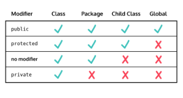

## Parent Class Aspect Modifiers
You may recall that Java class members use ```private and ```public``` access modifiers to determine whether they can be accessed from outside the class. So does a child class inherit its parent’s ```private``` members?

Well, no. But there is another access modifier we can use to keep a parent class member accessible to its child ```classes``` and to ```files``` in the package it’s contained in — and otherwise private: ```protected```.



Here’s what ```protected``` looks like in use:
```java
class Shape {

  protected double perimeter;

}

// any child class of Shape can access perimeter
```

In addition to access modifiers, there’s another way to establish how child classes can interact with inherited parent class members: using the ```final``` keyword. If we add ```final``` after a parent class method’s access modifier, we disallow any child classes from changing that method. This is helpful in limiting bugs that might occur from modifying a particular method.

Though it is not required, there is an established order when two or more field modifiers are used (eg. ```public final```). To learn more about this read the documentation.

**Noodle.java**
```java
public class Noodle {
    private double lengthInCentimeters;
    private double widthInCentimeters;
    private String shape;
    private String ingredients;
    private String texture = "brittle";
    
    Noodle(double lenInCent, double wthInCent, String shp, String ingr) {
        this.lengthInCentimeters = lenInCent;
        this.widthInCentimeters = wthInCent;
        this.shape = shp;
        this.ingredients = ingr;
    }
    
    public boolean isTasty() {
        return true;
    }
}
```

**Ramen.java**
```java
public class Ramen extends Noodle {
    Ramen() {
        super(30.0, 0.3, "flat", "wheat flour");  
    }
    public boolean isTasty(){
        return false;
    }
}
```

**EXERCISE:**
1. For now, all the instance fields of the ```Noodle``` class are ```private``` so the child class ```Ramen``` won’t be able to access them.

    Inside **Noodle.java**, Change the access modifiers of the ```ingredients``` and ```texture``` fields so that only the child classes can access them.

    **SOLUTION:**

    **Noodle.java**
    ```java
    public class Noodle {
        private double lengthInCentimeters;
        private double widthInCentimeters;
        private String shape;
        protected String ingredients;
        protected String texture = "brittle";
        
        Noodle(double lenInCent, double wthInCent, String shp, String ingr) {
            this.lengthInCentimeters = lenInCent;
            this.widthInCentimeters = wthInCent;
            this.shape = shp;
            this.ingredients = ingr;
        }
        
        public boolean isTasty() {
            return true;
        }
    }
    ```

2. The ```Noodle``` class has an ```isTasty()``` method that returns ```true``` because noodles are tasty. But if we check in the ```Ramen``` class, we can see someone overrode the ```isTasty()``` method to return ```false```! That person clearly doesn’t know about good food: all noodles are tasty.

    Remove the ```isTasty()``` method from ```Ramen``` and add a ```final``` keyword to ```isTasty()``` in the ```Noodle``` class so that nobody can change this method in any other ```Noodle``` child class again.

    Switch over to the **Main.java** file to run the code.

    **SOLUTION:**

    **Ramen.java**
    ```java
    public class Ramen extends Noodle {
        Ramen() {
            super(30.0, 0.3, "flat", "wheat flour");  
        }
        // public boolean isTasty(){
        //   return false;
        // }
    }
    ```

    **Noodle.java**
    ```java
    public class Noodle {
        private double lengthInCentimeters;
        private double widthInCentimeters;
        private String shape;
        protected String ingredients;
        protected String texture = "brittle";
        
        Noodle(double lenInCent, double wthInCent, String shp, String ingr) {
            this.lengthInCentimeters = lenInCent;
            this.widthInCentimeters = wthInCent;
            this.shape = shp;
            this.ingredients = ingr;
        }
        
        public final boolean isTasty() {
            return true;
        }
    }
    ```

    **Main.java**
    ```java
    public class Main{
        public static void main(String[] args) {
            Ramen yasaiRamen = new Ramen();
            //System.out.println(yasaiRamen.ingredients);
            System.out.println(yasaiRamen.isTasty());  
        }
    }
    ```

    OUTPUT:
    ```git
    true
    ```