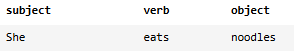
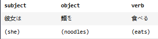

## Language Families
Languages, just like people, often have families. You can even map language lineage a bit like a family tree.

Java can help us build a model to track inherited traits across families. In this case, we’ll focus on something that often varies between language families: word order — where the subject, verb, and object would go in a sentence.

For example, in English, you would use subject-verb-object order:



But in Japanese, you would use subject-object-verb order:



Your Language Inheritance package has three Java files:

* **Language.java**: for the ```Language``` parent class, which serves as the template for all languages.
* **Mayan.java**: for ```Mayan```, a child class of ```Language``` modeled after the ```Mayan language family```.
* **SinoTibetan.java**: for ```SinoTibetan```, a child class of ```Language``` modeled after the ```Sino-Tibetan language family```

Build out a Java package with these classes to model real-world language families.

================================================

### A language by any other name

1. In Language.java, create a ````Language```` class with a ````main()```` method and the following fields:

    * ````name````: a protected string.
    * ````numSpeakers````: a protected integer.
    * ````regionsSpoken````: a protected string.
    * ````wordOrder````: a protected string.

    **SOLUTION:**

    **Language.java**
    ```java
    class Language {

        protected String name;
        protected int numSpeakers;
        protected String regionsSpoken;
        protected String wordOrder;

        public static void main(String[] args) {
            
        }
        
    }
    ```

2. Above the ```main()``` method, give ```Language``` a constructor that sets each field to the values passed in.

    **SOLUTION:**

    **Language.java**
    ```java
    class Language {

        protected String name;
        protected int numSpeakers;
        protected String regionsSpoken;
        protected String wordOrder;

        Language(String newName, int newNumSpeakers, String newRegionsSpoken, String newWordOrder) {
            this.name = newName;
            this.numSpeakers = newNumSpeakers;
            this.regionsSpoken = newRegionsSpoken;
            this.wordOrder = newWordOrder;
        }

        public static void main(String[] args) {
            
        }
        
    }
    ```

3. Create a ```public``` method for ```Language``` called ```getInfo()```. We’ll use this method to display all of its information (using its field values).

    The method should not return anything.

    We want to set up the information like this:

    ```git
    [name] is spoken by [numSpeakers] people mainly in [regionsSpoken].
    The language follows the word order: [wordOrder].
    ```

    For example, if we call ```spanish.getInfo();```, we’d want to see something like this:

    ```git
    Spanish is spoken by 555000000 people mainly in Spain, Latin America, and Equatorial Guinea.
    The language follows the word order: subject-verb-object.
    ```

    **SOLUTION:**

    **Language.java**
    ```java
    class Language {

        protected String name;
        protected int numSpeakers;
        protected String regionsSpoken;
        protected String wordOrder;

        Language(String newName, int newNumSpeakers, String newRegionsSpoken, String newWordOrder) {
            this.name = newName;
            this.numSpeakers = newNumSpeakers;
            this.regionsSpoken = newRegionsSpoken;
            this.wordOrder = newWordOrder;
        }

        public void getInfo() {
            System.out.println(this.name + " is spoken by " + this.numSpeakers + " people mainly in " + this.regionsSpoken + ".");
            System.out.println("The language follows the word order: " + this.wordOrder + ".");
        }

        public static void main(String[] args) {
            
        }
        
    }
    ```

4. Let’s test out the code so far!

    In ```main()```, instantiate a new ```Language``` of your choice.

    Then call ```getInfo()``` on the ```Language``` variable.

    Run your code in the terminal to see if the information gets printed. If nothing displays, try compiling your code first.

    **SOLUTION:**

    **Language.java**
    ```java
    class Language {

        protected String name;
        protected int numSpeakers;
        protected String regionsSpoken;
        protected String wordOrder;

        Language(String newName, int newNumSpeakers, String newRegionsSpoken, String newWordOrder) {
            this.name = newName;
            this.numSpeakers = newNumSpeakers;
            this.regionsSpoken = newRegionsSpoken;
            this.wordOrder = newWordOrder;
        }

        public void getInfo() {
            System.out.println(this.name + " is spoken by " + this.numSpeakers + " people mainly in " + this.regionsSpoken + ".");
            System.out.println("The language follows the word order: " + this.wordOrder + ".");
        }

        public static void main(String[] args) {
            Language spanish = new Language("Spanish", 555000000, "Spain, Latin America, and Equatorial Guinea", "subject-verb-object");
            spanish.getInfo();
        }
        
    }
    ```

### Not just an ancient civilization

5. Nice work! Now let’s model a language family.

    Tab over to **Mayan.java** and create an empty ```Mayan``` class that inherits from ```Language```.

    **SOLUTION:**

    **Mayan.java**
    ```java
    class Mayan extends Language {
  
    }
    ```

6. Mayan languages share several traits in common including:

    * ```regionsSpoken```: ```"Central America"```
    * ```wordOrder```: ```"verb-object-subject"```

    Tweak the ```Mayan``` constructor so that it isn’t necessary to pass in these fields when instantiating a new ```Mayan``` language object.

    Bear in mind that each language will still require its own ```name``` and ```numSpeakers```.

    **SOLUTION:**

    **Mayan.java**
    ```java
    class Mayan extends Language {

        Mayan(String nameLanguage, int numSpeakers) {
            super(nameLanguage, numSpeakers, "Central America", "verb-object-subject");
        }

    }
    ```

7. Mayan languages have an interesting grammatical feature: ```ergativity```.

    Override the ```getInfo()``` method for ```Mayan``` so that if we called ```getInfo()``` on a Mayan language like Ki’che’, we’d get the following info:

    ```git
    Ki'che' is spoken by 2330000 people mainly in Central America.
    The language follows the word order: verb-object-subject
    Fun fact: Ki'che' is an ergative language.
    ```

    **SOLUTION:**

    **Mayan.java**
    ```java
    class Mayan extends Language {

        Mayan(String nameLanguage, int numSpeakers) {
            super(nameLanguage, numSpeakers, "Central America", "verb-object-subject");
        }

        @Override
        public void getInfo() {
            System.out.println(this.name + " is spoken by " + this.numSpeakers + " people mainly in " + this.regionsSpoken + ".");
            System.out.println("The language follows the word order: " + this.wordOrder);
            System.out.println("Fun fact: " + this.name + " is an ergative language.");
        }

    }
    ```


8. Time to test out the tweaks you made to the ```Mayan``` class…

    Tab back over to **Language.java**.

    In ```main()```, instantiate a new ```Mayan``` language of your choice (you can find one ```here```).

    Then call ```getInfo()``` on the language variable.

    Run your code in the terminal to see if the information gets printed. If nothing displays, try compiling your code first.

    **SOLUTION:**

    **Language.java**
    ```java
    class Language {

        protected String name;
        protected int numSpeakers;
        protected String regionsSpoken;
        protected String wordOrder;

        public Language(String newName, int newNumSpeakers, String newRegionsSpoken, String newWordOrder) {
            this.name = newName;
            this.numSpeakers = newNumSpeakers;
            this.regionsSpoken = newRegionsSpoken;
            this.wordOrder = newWordOrder;
        }

        public void getInfo() {
            System.out.println(this.name + " is spoken by " + this.numSpeakers + " people mainly in " + this.regionsSpoken + ".");
            System.out.println("The language follows the word order: " + this.wordOrder + ".");
        }

        public static void main(String[] args) {
            Language spanish = new Language("Spanish", 555000000, "Spain, Latin America, and Equatorial Guinea", "subject-verb-object");
            spanish.getInfo();
            Mayan mayan = new Mayan("Ki'che'", 800000);
            mayan.getInfo();
        }

    }
    ```

### Heading east...

9. The Sino-Tibetan family has the second highest number of native speakers of any language family.

    Tab over to **SinoTibetan.** and build out an empty ```SinoTibetan``` class that inherits from ```Language```.

    **SOLUTION:**

    **SinoTibetan.java**
    ```java
    class SinoTibetan extends Language {

    }
    ```

10. Like the Mayan language family, Sino-Tibetan languages share several traits in common. In this case:

    * ```regionsSpoken```: ```"Asia"```
    * ```wordOrder```: ```"subject-object-verb"```

    Build a constructor for ```SinoTibetan``` that so that it isn’t necessary to pass in these fields when instantiating a new ```SinoTibetan``` language object.

    Remember — each language will still require its own ```name``` and ```numSpeakers```.

    **SOLUTION:**

    **SinoTibetan.java**
    ```java
    class SinoTibetan extends Language {
        SinoTibetan(String sinoName, int sinoNumSpeakers) {
            super(sinoName, sinoNumSpeakers, "Asia", "subject-object-verb");
        }
    }
    ```

11. So that word order thing? There is actually a ```split in the Sino-Tibetan family on this```.

    It turns out that at some point (a long time ago) the Chinese languages (among a few others) switched the object and verb order. So they now follow a subject-verb-object pattern. Hmm… How can we handle this?

    One (imperfect) tactic is to check if the language’s ```name``` field contains ```"Chinese"```. There’s a ```Java string method``` to check if a string contains a substring.

    In the constructor, below where you called ```super()```, change the ```wordOrder``` to ```"subject-verb-object"``` if ```this.name``` contains ```"Chinese"```.

    **SOLUTION:**

    **SinoTibetan.java**
    ```java
    class SinoTibetan extends Language {
        SinoTibetan(String sinoName, int sinoNumSpeakers) {
            super(sinoName, sinoNumSpeakers, "Asia", "subject-object-verb");
            if( sinoName.contains("Chinese") ) {
                this.wordOrder = "subject-verb-object";
            }
        }
    }
    ```

### Wrapping up

12. Test out the ```SinoTibetan``` class by instantiating two new Sino-Tibetan language objects of your choosing:

    * One ```Chinese``` (e.g., “Mandarin Chinese”)
    * One ```non-Chinese``` (e.g., Burmese)

    You can use any number for ```speakers``` when initializing these objects.

    Then call ```getInfo()``` on each language variable.

    Run your code in the terminal to see if the information gets printed. If nothing displays, try compiling your code first.

    **SOLUTION:**

    **Language.java**
    ```java
    class Language {

        protected String name;
        protected int numSpeakers;
        protected String regionsSpoken;
        protected String wordOrder;

        public Language(String newName, int newNumSpeakers, String newRegionsSpoken, String newWordOrder) {
            this.name = newName;
            this.numSpeakers = newNumSpeakers;
            this.regionsSpoken = newRegionsSpoken;
            this.wordOrder = newWordOrder;
        }

        public void getInfo() {
            System.out.println(this.name + " is spoken by " + this.numSpeakers + " people mainly in " + this.regionsSpoken + ".");
            System.out.println("The language follows the word order: " + this.wordOrder + ".");
        }

        public static void main(String[] args) {
            Language spanish = new Language("Spanish", 555000000, "Spain, Latin America, and Equatorial Guinea", "subject-verb-object");
            spanish.getInfo();
            Mayan mayan = new Mayan("Ki'che'", 800000);
            mayan.getInfo();
            SinoTibetan mandarin = new SinoTibetan("Mandarin Chinese", 1110000000);
            mandarin.getInfo();
            SinoTibetan burmese = new SinoTibetan("Burmese", 43000000);
            burmese.getInfo();
        }

    }
    ```

13. Congrats on all your work with Java Inheritance and Polymorphism! You’ve built out some useful classes for a linguist out there.

    #### BONUS

    There are many more language families you could create and there is a lot more you can do here. Check the hint for some ideas to make your Language Inheritance project even better.