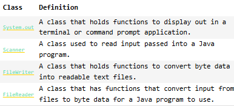
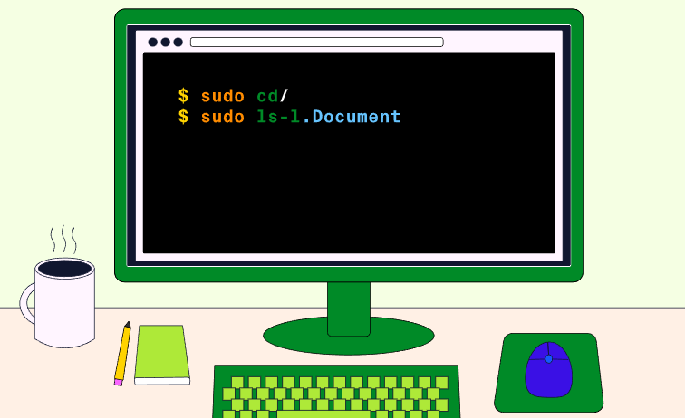

## Introduction

As computer users we are familiar with the response computer programs have from ```user input``` and ```output```. This lesson helps show the flip side of how programmers can code a Java program that considers, interprets, and responds to input and output. As this is your first adventure into the realms of more advanced Java, we want to encourage you to explore the Java documentation, the official technical data that goes along with each version of Java that is released.

Java is a powerful programming language that provides us with many ways to read input and write output to consoles, ```files```, etc. In this lesson, we will learn about some of the built-in ```classes``` that are useful for completing these tasks, specifically, reading and writing text to a file. Some of these classes include:



We will also learn how to handle potential exceptions that occur due to input and output in a Java program. By the end of this lesson, we will have successfully run a Java program through the terminal that is capable of reading and writing to the file system!

