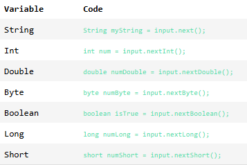
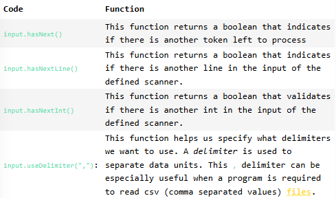
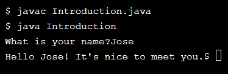

## Scanner Functionality

Now that we’re familiar with how to set up our Scanner instances, let’s dive into some of its functionalities and how to actually read input, whether that be from a file or from the console.

The first thing to know about the Scanner class is that it breaks up its input using a defined delimiter, and by default that delimiter is set to whitespace. This means every time there is a space or a new line in our input, the Scanner will recognize it as a new piece of the input, in fact, it can do its best to search the input for the specific type of information you are looking for, whether that be an integer, a word, or a character.

The next most important piece of the Scanner class is blocking. That means if the Scanner is waiting on ```user input``` from the terminal, it will block continued execution of the program until it gets its input.

The list below outlines some (but not all) of the different ```methods``` associated with the Scanner class that allow us to read the next piece of information we are looking for.



The ```Scanner``` class has several additional methods that help support data validation and control flow. We can use these to make sure we don’t try to process data that doesn’t exist and thereby run into ```errors``` in our program, also known as exceptions.



Let’s go ahead and ask the user to enter a name and then wait for their input. This is your first truly interactive program! Get Excited!

**Introduction.java**
```java
import java.util.Scanner;

public class Introduction {
    public static void main(String[] args) {
        Scanner input = new Scanner(System.in);
        
        // Add code below:
        
    }
}
```

**EXERCISE:**
1. Beneath the comment, write a print statement that asks the user what their name is.

    **SOLUTION:**
    ```java
    import java.util.Scanner;

    public class Introduction {
        public static void main(String[] args) {
            Scanner input = new Scanner(System.in);
            
            // Add code below:
            System.out.print("What is your name?");
            
        }
    }
    ```

2. After the print statement, declare a new String variable called ```userName```, initialize it to the Scanner’s next String input, and use the table from the exercise to find the appropriate method.

    Remember, once we ask the Scanner to find us information, we block the execution of the rest of the program. Nothing will run unless the input is received.

    **SOLUTION:**
    ```java
    import java.util.Scanner;

    public class Introduction {
        public static void main(String[] args) {
            Scanner input = new Scanner(System.in);
            
            // Add code below:
            System.out.print("What is your name?");
            String userName = input.next();
            
        }
    }
    ```

3. Use ```System.out.printf()``` to print the following statement:

    ```git
    Hello "userName"! It's nice to meet you.
    ```

    where “userName” is replaced with the input provided by the user.

    **SOLUTION:**
    ```java
    import java.util.Scanner;

    public class Introduction {
        public static void main(String[] args) {
            Scanner input = new Scanner(System.in);
            
            // Add code below:
            System.out.print("What is your name?");
            String userName = input.next();
            System.out.printf("Hello %s! It's nice to meet you.", userName);
            
        }
    }
    ```

4. Now let’s test it out! First, compile your program using the correct command in the terminal.

    **SOLUTION:**
    ```git
    javac Introduction.java
    ```

5. Now, run your program using the correct command in the terminal.


    **SOLUTION:**
    ```git
    java Introduction
    ```

    OUTPUT:
    